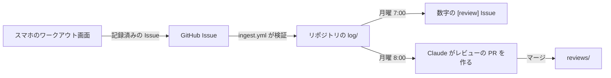

# muscle

筋肥大について論文で調べた知見をまとめたノートと、それをもとに組んだメニュー、そして毎週自動でふり返るトレーニング記録のリポジトリ。

**サイト: <https://0-draft.github.io/muscle/ja/>**（日本語） · [English](https://0-draft.github.io/muscle/) · [README (English)](README.md)

## 中身

- **知見**: 12 トピック（ボリューム、追い込み、可動域、タンパク質、食が細い人の増量、ブランク明けの再開、記録を続ける仕組みなど）。主張ごとに根拠の強さを付けていて、出典にはすべて PubMed の ID があり、CI が照合している
- **メニュー**: 週 2 回・上半身の 12 週の再開プログラム。スマホで開くと試技ボードになる。前回の数字が最初から入っていて、± で調整して「完了」を押すだけ。プレートの付け方とウォームアップの提案、休憩時計、自己新記録のときの判定演出、ワンタップの記録がある
- **記録ページ**: セッションを記録するたびに作り直される。記録ボード、部位別セット数の筋肉マップ、推定 1RM の推移、トレーニングした日、体重の推移
- **ログ**: トレーニングと体重を、このリポジトリにテキストで保存する。毎週月曜に集計される

## 根拠レベル

主張ごとに、試技台と同じ 3 つの審判ランプで根拠を判定する。白が成功、赤が失敗。白ランプの数がそのままレベルで、赤ランプには斜線が入るので、色だけに頼らない。プレートの色は、ジムと同じく重量を表すのに使う。

| レベル | ランプ | 意味 |
| --- | --- | --- |
| A | ⚪⚪⚪ | 複数のメタ分析・系統的レビューで結論が一致 |
| B | ⚪⚪🔴 | メタ分析 1 本、または複数の RCT で支持 |
| C | ⚪🔴🔴 | 少数の RCT や観察研究のみ |
| D | 🔴🔴🔴 | 専門家の意見・メカニズムからの推測 |

初心者を対象にした研究しかない場合、トレーニング経験者に当てはめるときは白ランプを 1 つ減らす。

## 使い方

| いつ | やること | どこで |
| --- | --- | --- |
| ジムで | 試技ボードで重量を合わせて **完了** を押し、時計が鳴るまで休む | スマホのメニューページ（ホーム画面に追加しておく） |
| セッションのあと | **このセッションを記録する** を押し、GitHub で **Submit**（完了したセットがそのまま入っている） | メニューページ |
| 毎朝 | 体重を入れて **体重を記録する** → **Submit** | メニューページ |
| 4 週ごと | 朝の体重と一緒にウエストも入れる | メニューページ |
| 月曜の朝 | 先週の数字を見て、Claude が書いたレビューの PR をマージする | GitHub の通知 |

ファイルを直接編集するときの書式は [`log/README.md`](log/README.md)（英語）にある。

## 自動で動くもの



| タイミング（日本時間） | 内容 | 実行場所 |
| --- | --- | --- |
| 記録の Issue が立つたび | 検証して `log/` にコミットし、Issue を閉じる（問題があればコメントで理由を返す） | GitHub Actions `ingest.yml` |
| 毎週月曜 7:00 | 先週の部位別セット数、推定 1RM の推移、体重の 7 日平均を Issue で投稿 | GitHub Actions `weekly-review.yml` |
| 毎週月曜 8:00 | 日本語のレビューを書いて PR を出す。2 週目が終わった最初のレビューでは、12 週の目標も `goals.md` に提案する | Claude のルーティン |
| 毎月 1 日 9:00 | 全 PMID を PubMed と照合する（撤回論文も含む）。問題があれば Issue を立てる | GitHub Actions `refs-watch.yml` |
| 毎月 1 日 9:00 | 60 日以上見直していないページについて新しい論文を探し、PR を出す | Claude のルーティン |
| push のたび | lint、型チェック、ユニットテスト、ビルド、PubMed 照合、E2E とアクセシビリティ検査、デプロイ | GitHub Actions `check.yml`・`deploy.yml` |

記録として取り込むのは `kanywst` が立てた Issue だけ。リポジトリは public なので、記録も公開される。

## ファイル構成

```text
knowledge/{ja,en}/   1 トピック 1 ファイル。日本語を先に書き、英語はそれに合わせる
program/plan.json    種目・セット・レップ・RIR・休憩・フェーズ（ワークアウト画面のもと）
program/{ja,en}/     メニューの組み方の根拠、週のセット数、食事
log/                 training/YYYY-MM.txt と body.csv
goals.md             週次レビューが照らし合わせる目標
reviews/             週次レビュー
data/exercises.json  種目 ID と、どの部位に数えるか
scripts/             記録の取り込み、週次の集計、PubMed の照合
src/                 Astro のサイト
.claude/skills/      research、weekly-review、update-program
```

## Claude Code で使うコマンド

| コマンド | 使いどころ |
| --- | --- |
| `/research <トピック>` | トピックを調べて、日英両方のページを書く・更新する |
| `/weekly-review` | 今週のレビューをその場で書く |
| `/update-program` | 記録からメニューの変更案を出し、承認したら反映する |

## 開発

Node 24 以上が必要。

```bash
npm install
npm run dev            # http://localhost:4321/muscle/ でローカル表示
npm run build
npm run lint           # markdownlint
npm run check          # astro check（型）
npm test               # ユニットテスト
npm run e2e            # Playwright：アクセシビリティとワークアウト画面（先に build。初回だけ npx playwright install chromium）
npm run verify-refs    # 全 PMID を PubMed と照合
npm run review -- --end 2026-09-30
```

## 注意

個人の調査メモで、医療アドバイスではない。数字は研究の平均値なので、自分の記録で確かめながら使う。
