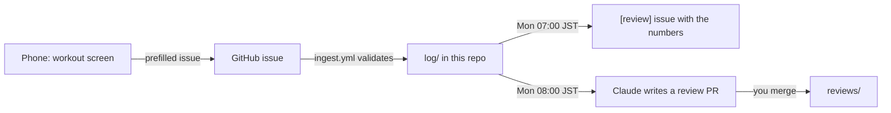

# muscle

An evidence-graded notebook on building muscle, a training program built from it, and a training log that reviews itself every week.

**Site: <https://0-draft.github.io/muscle/>** (English) · [日本語](https://0-draft.github.io/muscle/ja/)

## What's here

- **Knowledge**: 12 topics (volume, effort, range of motion, protein, eating with a small appetite, restarting after a layoff, habits, and more). Every claim carries an evidence grade, and every source has a PubMed ID that CI checks.
- **Program**: a 12-week, 2-day-a-week upper-body restart program. On a phone it becomes a workout screen: tick sets, rest timer, keep-screen-on, one-tap logging.
- **Log**: training sessions and body weight, stored as plain text in this repo and summarized every Monday.

## Evidence grades

Each claim is shown as a bumper plate. Heavier plate, stronger evidence. The letter and plate height carry the grade too, so it never depends on colour alone.

| Grade | Plate | Meaning |
| --- | --- | --- |
| A | Red, 25 kg | Several meta-analyses or systematic reviews agree |
| B | Blue, 20 kg | One meta-analysis, or several RCTs |
| C | Yellow, 15 kg | A few RCTs or observational studies only |
| D | White, 5 kg | Expert opinion or reasoning from mechanisms |

Evidence from untrained people only is graded one step lower when applied to trained lifters.

## Using it

| When | Do this | Where |
| --- | --- | --- |
| At the gym | Follow today's cards, tap each set when done, rest until the timer beeps | Program page on your phone (add it to the home screen) |
| After the session | Type what you lifted, tap **Log this session**, then **Submit** on GitHub | Program page |
| Every morning | Enter your weight, tap **Log weight**, then **Submit** | Program page |
| Every 4 weeks | Add your waist to the morning weigh-in | Program page |
| Monday morning | Read the weekly numbers and merge the written review | GitHub notifications |

Log format, if you ever edit the files by hand: [`log/README.md`](log/README.md).

## What runs by itself



| Schedule (JST) | What | Runs on |
| --- | --- | --- |
| On every log issue | Validate, commit to `log/`, close the issue (or comment what's wrong) | GitHub Actions `ingest.yml` |
| Monday 07:00 | Post last week's sets per muscle, e1RM trends and 7-day weight average as an issue | GitHub Actions `weekly-review.yml` |
| Monday 08:00 | Write a review in Japanese and open a PR; the first review after week 2 also proposes 12-week goals in `goals.md` | Claude routine |
| 1st of the month, 09:00 | Re-check every PMID against PubMed, including retractions; open an issue on problems | GitHub Actions `refs-watch.yml` |
| 1st of the month, 09:00 | Look for new evidence on pages not reviewed for 60 days and open a PR | Claude routine |
| Every push | Lint, type check, unit tests, build, PubMed check, E2E and accessibility tests, then deploy | GitHub Actions `check.yml`, `deploy.yml` |

Only issues opened by `kanywst` are written to the log. The repo is public, so the log is public too.

## Repository layout

```text
knowledge/{ja,en}/   one topic per file; Japanese is written first, English mirrors it
program/plan.json    exercises, sets, reps, RIR, rest and phases (drives the workout screen)
program/{ja,en}/     why the program is built this way, weekly set counts, nutrition
log/                 training/YYYY-MM.txt and body.csv
goals.md             process and outcome goals the weekly review checks against
reviews/             weekly reviews
data/exercises.json  exercise ids and the muscles they count toward
scripts/             log ingest, weekly summary, PubMed reference check
src/                 the Astro site
.claude/skills/      research, weekly-review, update-program
```

## Working with Claude Code

| Command | Use it to |
| --- | --- |
| `/research <topic>` | Research a topic and write or update its page in both languages |
| `/weekly-review` | Write this week's review on demand |
| `/update-program` | Propose program changes from the logs, then apply them after you approve |

## Development

Requires Node 24 or later.

```bash
npm install
npm run dev            # local site at http://localhost:4321/muscle/
npm run build
npm run lint           # markdownlint
npm run check          # astro check (types)
npm test               # unit tests
npm run e2e            # Playwright: accessibility and workout flow (build first; run `npx playwright install chromium` once)
npm run verify-refs    # every PMID against PubMed
npm run review -- --end 2026-09-30
```

## Disclaimer

Personal research notes, not medical advice. Numbers are study averages; test them against your own log.
